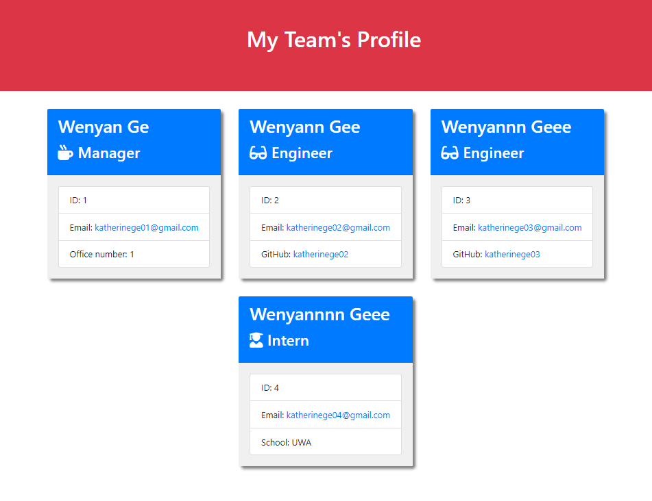

# Team Profile Generator

## Table of Contents
* [Project description](#description)
* [How to install the app](#installation)
* [How to use the app](#usage)
* [License](#license)

# Project description
This project is to build a Node.js command-line application which takes in employees' information and present their profile cards in the team html file.
# How to install the app
As shown in this video ([Click link to watch the video](https://youtu.be/yjgk6yUAE-w)), we need to:
* First run the npm install

* Second run the test files by entering "npm run test" to make sure no errors
* When all passes, we can run the node index.js to start the generating process.

# How to use the app
After running the node index.js, we will then need enter the employees' details one by one.
* First we need to select the employee position from the list (Manager, Engineer or Intern).

* It will then ask for more informaion (i.e. employee ID, email address, office number, github name, school, ect.). The required employee details may very dpending on the position.
* When finish adding, select "No more team members to be added" option from the list.
* A message will appear to let you know that the team's profile is now created.
* A html file will be generated automatically in the output folder, and the page is shown as below

### A detailed step by step guid is also recorded in the [video](https://youtu.be/yjgk6yUAE-w) for visualised demonstration.

# License
MIT